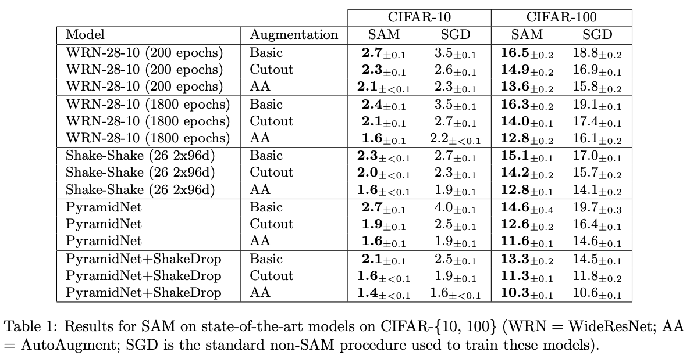
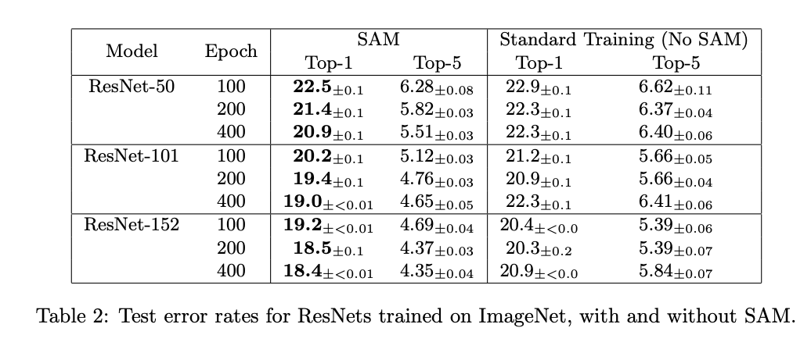
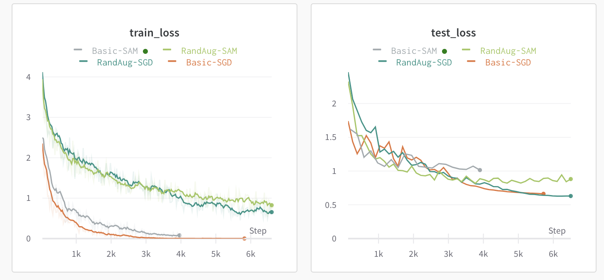
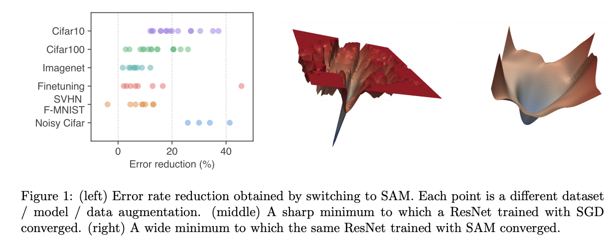

# Winter 2020 Research Participation Final Report

- 윤병준 20190766

- [Github](https://github.com/unajun/cvlab-project)
- [wandb](https://wandb.ai/happyhappy/cvlab-cifar100-efficient-net)

## Project objective

원래 텐서플로우와 케라스를 사용했었는데, 이번 연구 참여를 통해서 파이토치에 직접적인 활용을 배우고자 했다. 또한, 주먹구구식으로 파라미터나 실험 결과등을 관리하였는데, wandb 등을 이용하여, 실험 로깅, 파라미터 서치 자동화, 시각화를 달성하고자 한다. Hydra를 이용하여 argparser보다 좀 더 편하게 설정관리를 하도록 개발하였다. 

## Wandb

위 링크로 wandb에 들어가면 실행 로그를 확인 할 수 있다. 왼쪽 탭에서 각 훈련을 선택해 자세한 실행 결과를 확인 할 수 있다. 각 훈련 창으로 들어오면, 왼쪽에서 메뉴를 선택해 다음 사항들을 볼 수 있다. 

- Chart: 훈련 결과의 차트 (train/test의 loss와 accuracy 만 플롯하도록 해놨다)
- System: 훈련 시 시스템 상황 그래프
- Log: 훈련 로그 파일
- Files: 훈련에서 사용하거나 저장한 파일들을 볼 수 있다. (모델 체크포인트는 여기서 확인 가능하다)


## Summary

최종적으로 진행한 실험은 Sharpness-Aware Minimization for Efficiently Improving Generalization 논문에서 연구된 SGD 기반 SAM optimizer 와 RandAugmentation 의 효과를 실험을 해보았습니다. 해당 논문에서는 Resnet50 모델에 대해서는 다양한 Augmentation method 에 대한 테스트가 없었습니다. 

모델 선정을 파라미터 크기가 작으면서 코드에 추가하기 좋고, 논문에서 언급되어 비교할만한 대상이 있는 resnet50으로 진행했습니다. 50보다 큰 모델은 파라미터의 갯수가 너무 많고, GPU에 올리려면 배치 크기를 줄여야해 보고서 완료 듀를 맞추기 위해, 50으로 정하였습니다. 초기에는 파라미터의 갯수도 Resnet50의 5분의 1 정도인 EfficientNet-B0 를 택하려고 했으나, 알 수 없는 버그로 인데 GPU에 모델과 데이터가 올라가지 않아 Resnet50으로 진행했습니다. 





SAM 논문에서는 Augmentation 방법에 따른 오차율을 Wideresnet 등의 모델로 연구를 하였습니다, 또한 Resnet50 에 대해서는 




ImageNet 데이터셋으로 진행한 실험결과에 대해 언급했습니다. 


저의 실험에서는 Resnet50 모델에서 SAM 와 SGD optimizer 를 사용했을때와 Augmentation 에서의 Cutoff vs. RandAugment 에 따른 성능차이로 최종적으로 4개의 훈련을 진행하였습니다. 


|        | SAM   | No SAM |
| ------ | ----- | ------ |
| Cutoff | 83.1  | 84.17  |
| RA     | 78.72 | 79.85   |

- Model: Resnet-50
- pretrained with ImageNet
- epoch: 50
- Learning Rate: initial 0.1 and cosine learning rate decay
- Optimizer:
  - Momentum: 0.9
  - Weight_decay: 1e-4

초기 학습률과 weight decay 는 RandAugment 논문을 참고하여 그리드 탐색을 진행했습니다. (Cubuk 2019). 

RandAugment 를 적용했을때는 오히려 성능이 감소하였습니다.  하지만 다음 그래프를 보면 regularization 을 목적으로 하는 augmentation이기 때문에, 




cutoff 는 train loss는 굉장히 빠르게 수렴한 것에 비해, RA의 경우는 훈련 종료 시점에 아직도 train loss 와 test loss가 비슷한 것을 볼 수 있습니다. 학습률을 코사인 디케이로 설정하였기에 학습 후반부에는 학습률이 굉장히 낮은데, 만약 epoch를 증가시켜 훈련을 한다면, cutoff와 비교했을때, 정확도가 거의 같아 질 수 있다고 생각합니다.
SAM optimizer를 사용했을때의 test accuracy 를 보면, 초기에는 SGD 와 비교했을때, 로스가 가파르게 떨어지지만, epoch가 증가함에 따라 로스 감소율이 점점 줄어든다. 
학습률 스케쥴러를 cosine decay로 했는데, 왜 이런지는 SAM의 paramter space를 보면 알 수 있다. 



훈련이 종료됨에 따라 학습률이 감소하는 스케쥴러이기 때문에, 왼쪽처럼 일반적인 SGD로 최적화를 진행했을 때는, 학습률이 적어도 좀 더 local minima 에 도달 할 수 
있을 것이다. 하지만, 오른쪽의 SAM에서는 
  >SAM functions by
seeking parameters that lie in neighborhoods having uniformly low loss value (rather than parameters that only themselves have low loss value, as illustrated in the middle and righthand
images of Figure 1)

50 epoch 만 진행했기 때문에 로컬미니마에 주위에 도달하지 못한 상태에서 학습률이 줄어 최종적으로는 성능이 더 낮게 나왔다. 
물론 (Foret 2019) 에서도 Resnet50은 SAM을 적용했는때 오차율 감소가 거의 없다. 이 실험을 진행하며 논문을 다시 읽어보았는데, 
이러한 smooth space에서 진행하는 최적화의 경우는 모델의 크기가 클수록 좀 더 dramatic한 효과를 보이는 것으로 보인다.  

## Futher work
시간 관계상 epoch를 높게 잡고 하지 못하여 오차율을 완전히 최소화 하지 못하였는데, 그부분에 대한 훈련이 더 계속 되면 좋을 것 같다. 또한, 현재에는 잘 안 쓰는 resnet
 같은 모델이 아니라, 모바일이나 다른 더 좋은 모델들에 대해서, SAM의 효과를 확인 해보면 좋을것 같다. 
 마지막으로 원래는 RandAugment가 아닌 AutoAugment가 이미 Cifar10에 대한 policy를 퍼블릭 공개하여, 그것을 사용하려고 했는데, 파이썬 에러로 하지 못하였다. 
 이부분에 대해 각 augmenter의 효과를 분석해보고 싶다. 

## Reference

```bibtxt
@misc{he2015deep,
      title={Deep Residual Learning for Image Recognition}, 
      author={Kaiming He and Xiangyu Zhang and Shaoqing Ren and Jian Sun},
      year={2015},
      eprint={1512.03385},
      archivePrefix={arXiv},
      primaryClass={cs.CV}
}

@article{Kornblith_2019,
   title={Do Better ImageNet Models Transfer Better?},
   ISBN={9781728132938},
   url={http://dx.doi.org/10.1109/CVPR.2019.00277},
   DOI={10.1109/cvpr.2019.00277},
   journal={2019 IEEE/CVF Conference on Computer Vision and Pattern Recognition (CVPR)},
   publisher={IEEE},
   author={Kornblith, Simon and Shlens, Jonathon and Le, Quoc V.},
   year={2019},
   month={Jun}
}

@misc{foret2020sharpnessaware,
    title={Sharpness-Aware Minimization for Efficiently Improving Generalization},
    author={Pierre Foret and Ariel Kleiner and Hossein Mobahi and Behnam Neyshabur},
    year={2020},
    eprint={2010.01412},
    archivePrefix={arXiv},
    primaryClass={cs.LG}
}

@misc{cubuk2018autoaugment,
    title={AutoAugment: Learning Augmentation Policies from Data},
    author={Ekin D. Cubuk and Barret Zoph and Dandelion Mane and Vijay Vasudevan and Quoc V. Le},
    year={2018},
    eprint={1805.09501},
    archivePrefix={arXiv},
    primaryClass={cs.CV}
}

@misc{cubuk2019randaugment,
    title={RandAugment: Practical automated data augmentation with a reduced search space},
    author={Ekin D. Cubuk and Barret Zoph and Jonathon Shlens and Quoc V. Le},
    year={2019},
    eprint={1909.13719},
    archivePrefix={arXiv},
    primaryClass={cs.CV}
}


@misc{tan2019efficientnet,
    title={EfficientNet: Rethinking Model Scaling for Convolutional Neural Networks},
    author={Mingxing Tan and Quoc V. Le},
    year={2019},
    eprint={1905.11946},
    archivePrefix={arXiv},
    primaryClass={cs.LG}
}
```


